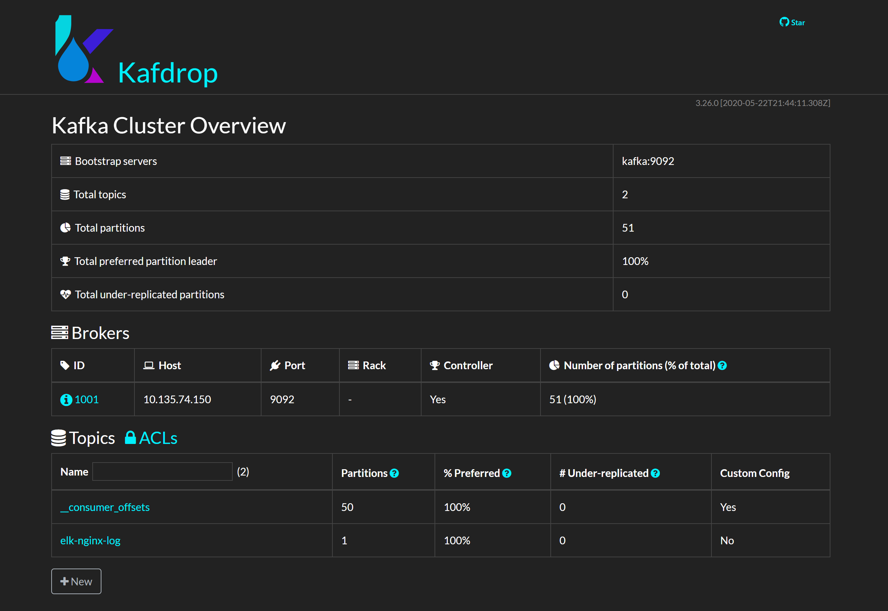

# Kafka 消息队列

## Kafka 服务配置

在 docker-compose.yaml 对于 Kafka 服务的配置中：

```yaml
  zookeeper:
    image: wurstmeister/zookeeper
    ports:
      - "2181:2181"
    networks:
      - elk
  
  kafka:
    image: wurstmeister/kafka:2.12-2.1.0
    ports:
      - "9092:9092"
    environment:
      KAFKA_ADVERTISED_HOST_NAME: $HOST_IP
      KAFKA_ZOOKEEPER_CONNECT: zookeeper:2181
      KAFKA_HEAP_OPTS: "-Xmx512M -Xms512M"
    volumes:
      - /var/run/docker.sock:/var/run/docker.sock
    depends_on:
      - zookeeper
    networks:
      - elk

  kafdrop:
    image: obsidiandynamics/kafdrop
    ports:
      - "9000:9000"
    environment:
      KAFKA_BROKERCONNECT: kafka:9092
      JVM_OPTS: "-Xms32M -Xmx64M"
      SERVER_SERVLET_CONTEXTPATH: "/"
    depends_on:
      - kafka
    networks:
      - elk
```

- Kafka 依赖 zookeeper 提供分布式状态存储服务
- 注意选择 Kafka 的版本和 ELK 兼容，这里选的是 `wurstmeister/kafka:2.12-2.1.0`
- 使用名为 elk 的子网络，这样便可以访问同样使用这个子网络的其他容器
- 使用 Kafka 可视化管理工具 Kafdrop 可以查看 Kafka 当前运行状态

## Kafdrop 可视化管理后台


[Kafdrop](https://github.com/obsidiandynamics/kafdrop) 是一款 Kafka web ui 软件，支持丰富的管理功能，包括：

- 查看 Kafka 节点
- 查看/创建 Topics
- 浏览消息
- 查看 consumer groups
- ...




## 小结

Kafka 作为消息队列服务，具有高吞吐、低延迟、高并发、高可用等优点，应用到 Elastic Stack 中可以显著提升整个系统的稳定性。

成百上千的 Filebeat 实例可以即时地将大量日志转发到 Kafka，再由 Logstash 按照阈值能力慢慢处理，达到「削峰填谷」的效果。