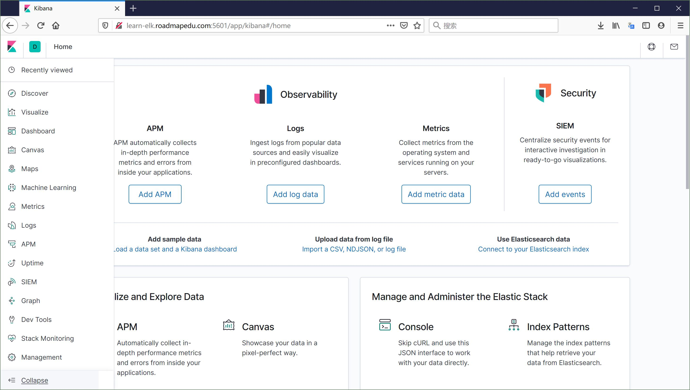

# Kibana 分析日志

## Kibana 服务配置

在 docker-compose.yaml 对于 Kibana 服务的配置中：

```yaml
  kibana:
    build:
      context: kibana/
      args:
        ELK_VERSION: $ELK_VERSION
    volumes:
      - type: bind
        source: ./kibana/config/kibana.yml
        target: /usr/share/kibana/config/kibana.yml
        read_only: true
    ports:
      - "5601:5601"
    networks:
      - elk
    depends_on:
      - elasticsearch
```

- 使用 kibana/ 目录下的 Dockerfile 构建镜像
- 数据卷映射：
    - 将宿主机目录下的配置文件映射到容器内
- 使用名为 elk 的子网络，这样便可以访问同样使用这个子网络的其他容器

## 运行效果

