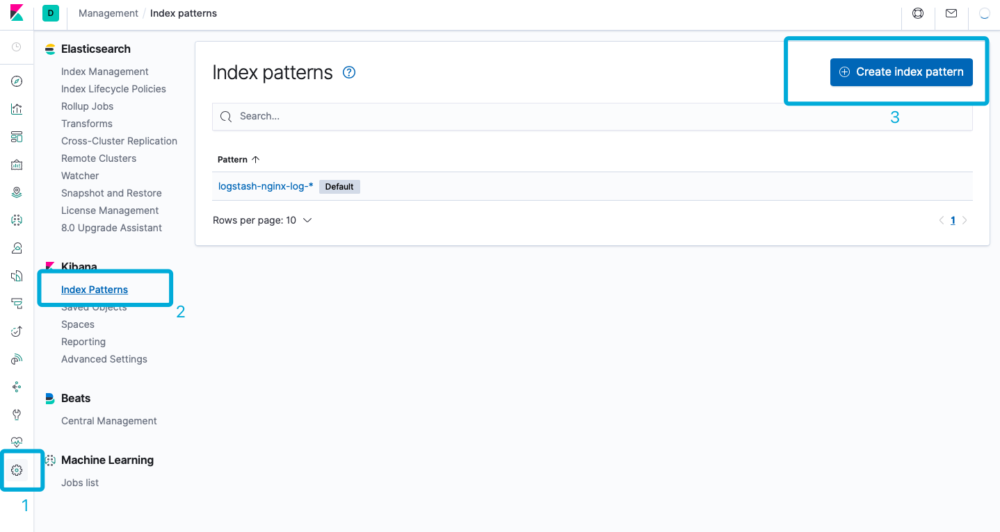
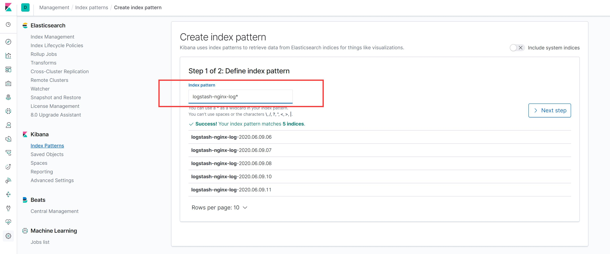
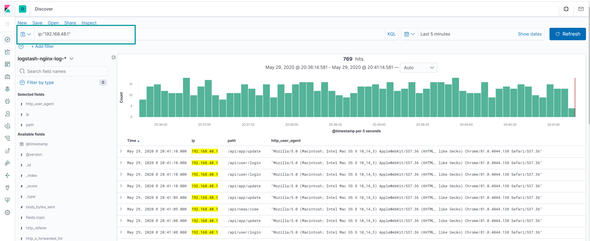

# 查询日志

## 创建 Index Pattern

Nginx 访问日志经过收集、过滤、索引后就可以通过 Kibana 查询，但是查询之前需要指定索引 index pattern:



如上述截图示例，在 Kibana 管理 > Index Patterns > Creata Index Pattern 进入创建页面：



Index Pattern 的名称是由 Logstash 配置的时候确定的：
```yaml
#logstash/pipeline/nginx.conf

output {

  elasticsearch {
    hosts => "elasticsearch:9200"
    index => "logstash-%{[fields][topic]}-%{+YYYY.MM.dd.HH}"
  }
}

```

## 查询日志

在搜索框输入要查询的字段的值，同时在右侧选择时间区间，就可以开始查询索引的日志：



## 查询语法

- 精准查询：
    - `ip:"192.168.42.10"`
    - `path:"/api/user/login"`
    - `status:404`

- 模糊查询：
    - `p_key:"关键词*"`

- AND 与查询：
    - `ip:"192.168.42.10" AND status:404`
    
- OR 或查询：
    - `ip:"192.168.42.10" OR status:404`
    - `(ip:"192.168.42.10" AND status:404) OR (ip:"192.168.42.11" AND status:503)`

- NOT 非查询：
    - `NOT ip:"192.168.42.10"`

- 比较查询：
    - `status >= 500`

更多查询语法，参考 [https://www.elastic.co/guide/en/kibana/7.7/kuery-query.html](https://www.elastic.co/guide/en/kibana/7.7/kuery-query.html)