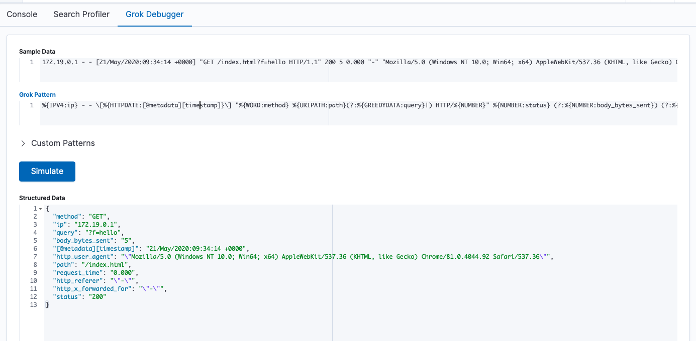

# Logstash 处理日志


## Logstash 服务配置

在 docker-compose.yaml 对于 Logstash 服务的配置中：

```yaml
  logstash:
    build:
      context: logstash/
      args:
        ELK_VERSION: $ELK_VERSION
    volumes:
      - type: bind
        source: ./logstash/config/logstash.yml
        target: /usr/share/logstash/config/logstash.yml
        read_only: true
      - type: bind
        source: ./logstash/pipeline
        target: /usr/share/logstash/pipeline
        read_only: true
    ports:
      - "9600:9600"
    environment:
      LS_JAVA_OPTS: "-Xmx256m -Xms256m"
    networks:
      - elk
    depends_on:
      - elasticsearch
```

- 使用 logstash/ 目录下的 Dockerfile 构建镜像
- 数据卷映射：
    - 将宿主机目录下的配置文件映射到容器内
- 使用名为 elk 的子网络，这样便可以访问同样使用这个子网络的其他容器


## Logstash Pipeline 配置

在 `logstash/pipeline/nginx.conf` 配置：

```yaml
{{#include ../docker-compose/logstash/pipeline/nginx.conf}}
```

Logstash pipeline 配置主要分为 3 个部分： `input`/`filter`/`output`

对于 `input` 模块：

- 配置数据来源，这里是从 Kafka 获取日志
- 更多来源配置，参见 [https://www.elastic.co/guide/en/logstash/current/input-plugins.html](https://www.elastic.co/guide/en/logstash/current/input-plugins.html)

对于 `filter` 模块：

- 配置数据过滤或格式化规则，这里主要使用 `grok` 和 `kv` 匹配日志字段和解析请求参数
- 更多过滤器配置，参见 [https://www.elastic.co/guide/en/logstash/current/filter-plugins.html](https://www.elastic.co/guide/en/logstash/current/filter-plugins.html)

对于 `output` 模块：

- 配置格式化后的数据输出目标，这里将日志输出到 Elasticsearch 
- 更多输出配置，参见 [https://www.elastic.co/guide/en/logstash/current/output-plugins.html](https://www.elastic.co/guide/en/logstash/current/output-plugins.html)


### 关于 Grok

Grok 是正则匹配工具，更多正则模式请参考 [https://grokdebug.herokuapp.com/patterns#](https://grokdebug.herokuapp.com/patterns#)


