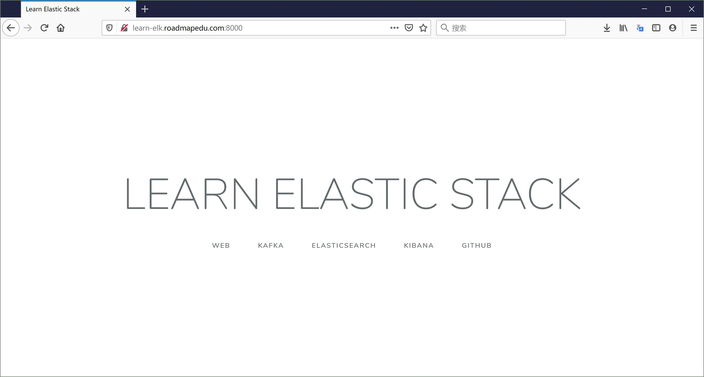

# Nginx 访问日志

## Nginx 服务配置

在 docker-compose.yaml 对于 Nginx 服务的配置中：

```yaml
 nginx:
    image: nginx:1.18
    ports:
    - "8000:80"
    volumes:
      - "./nginx/nginx.conf:/etc/nginx/nginx.conf:ro"
      - "./nginx/html:/usr/share/nginx/html:ro"
      - type: volume
        source: nginx-log
        target: /var/log/nginx
```

- 使用 Nginx 1.18 版本的官方镜像，默认使用的镜像仓库地址为： [https://hub.docker.com/_/nginx](https://hub.docker.com/_/nginx)
- 将宿主机的 8000 端口映射到到 Nginx 容器内的 80 端口，这样就可以通过宿主机地址访问容器内服务
- 数据卷映射：
    - 将宿主机目录下的配置文件 以及 `html` 目录映射到容器内相应的目录，这样容器内应用就可以访问宿主机上的文件或目录
    - 使用宿主机上名为 `nginx-log` 的数据卷，并映射到容器内的 `/var/log/nginx` 目录，目的是让运行在同一宿主机上的容器之间共享目录
    - Filebeat 容器也会用到 `nginx-log` 数据卷，在这个目录收割 Nginx 访问日志

## Nginx 配置

对于 `nginx/nginx.conf` 配置：

```nginx
{{#include ../docker-compose/nginx/nginx.conf}}
```

通过配置 Nginx 日志格式，可以将每个用户的访问信息记录到日志中，主要包括以下字段：

- `$remote_addr` 用户 ip 地址
- `$remote_user` 用户标识
- `$time_local` 服务器时间
- `$request` http 请求头信息，包括 http method / uri / http 版本
- `$status` 服务器响应状态码，例如 200/302/404/504
- `$body_bytes_sent` 服务器响应内容大小(单位 bytes)
- `$request_time` 请求处理时间
- `$http_referer` 请求来源 referer
- `$http_user_agent` 用户系统/浏览器等信息
- `$http_x_forwarded_for` 网络代理 ip 列表(如果使用代理)


日志示例：

```shell
#tail -f /var/log/nginx/elk-access.log 
192.168.0.1 - - [26/May/2020:12:31:31 +0000] "GET /api/news/view HTTP/1.0" 404 555 0.000 "-" "Mozilla/5.0 (Macintosh; Intel Mac OS X 10_14_5) AppleWebKit/537.36 (KHTML, like Gecko) Chrome/81.0.4044.138 Safari/537.36" "-"
192.168.0.1 - - [26/May/2020:12:31:32 +0000] "GET /api/app/update HTTP/1.0" 404 555 0.000 "-" "Mozilla/5.0 (Macintosh; Intel Mac OS X 10_14_5) AppleWebKit/537.36 (KHTML, like Gecko) Chrome/81.0.4044.138 Safari/537.36" "-"
192.168.0.1 - - [26/May/2020:12:31:32 +0000] "GET /api/user/login HTTP/1.0" 404 555 0.000 "-" "Mozilla/5.0 (Macintosh; Intel Mac OS X 10_14_5) AppleWebKit/537.36 (KHTML, like Gecko) Chrome/81.0.4044.138 Safari/537.36" "-"
```

这些日志将被 Filebeat 采集后投递到 Kafka 消息队列，再经过 Logstash 的格式化处理后，索引到 Elasticsearch 中，最后通过 Kibana 可视化查询。

## 运行效果

