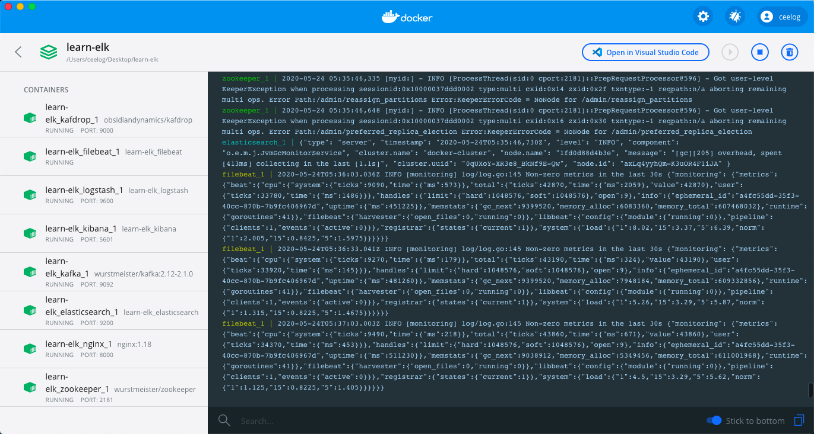
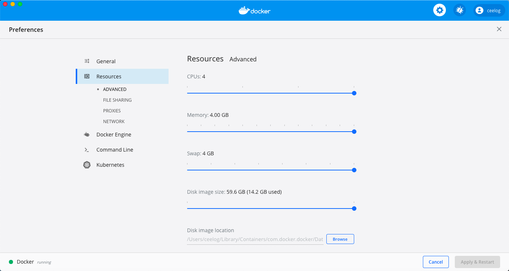
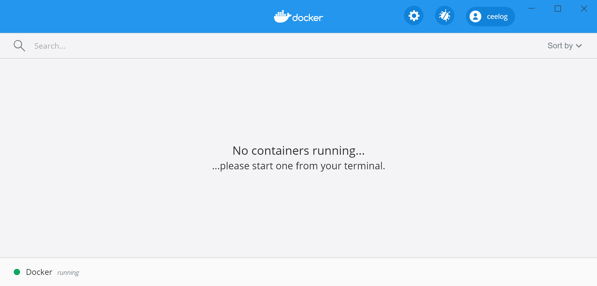
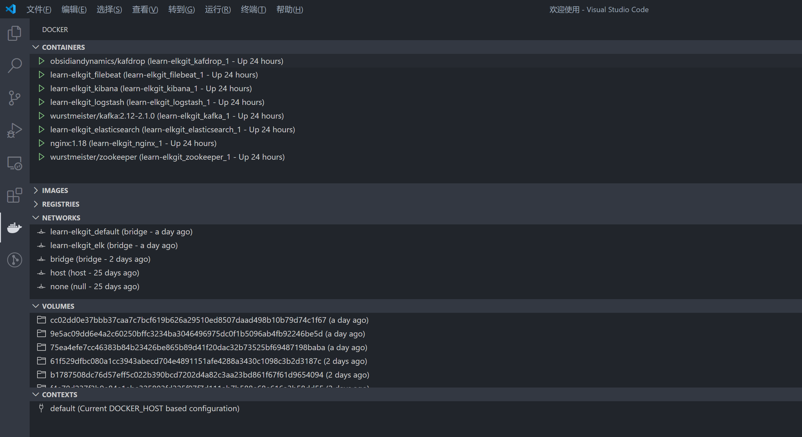

# 演示环境安装与配置

## 本地开发环境

为了深入理解各个组件的使用，建议读者在本地搭建一个开发环境。

为了解决系统环境和依赖的问题，本小册使用 Docker 容器运行各个组件，并使用 Docker Compose 进行服务编排，实现可「一键启动」的开发环境。

### Docker 下载与安装

Docker 是一种容器化技术，可以将软件及其依赖的运行环境打包进一个容器中，和虚拟机不同的是，Docker 容器非常轻量，可以实现秒级的启动或关闭。

- Docker 支持 Linux / Windows / MacOS 平台。

- 在官网下载与安装 Docker [https://docs.docker.com/get-docker/](https://docs.docker.com/get-docker/)

- 系统配置要求：
  - 4GB 以上内存
  - 2 核以上 CPU

#### Docker Desktop for Windows/Mac

为了支持 Windows 和 Mac 操作系统，Docker 开发了 Docker Desktop for Windows/Mac

以下是 Docker Desktop 运行起来的界面：



可以通过设置页面，配置足够的计算资源：



#### Docker for Linux

由于 Docker 源于 Linux 虚拟化技术，所以对 Linux 操作系统支持的很好。

安装参见 [https://docs.docker.com/engine/install/](https://docs.docker.com/engine/install/)

#### 启动 Docker

Docker Desktop for Windows/Mac 安装完成后，直接双击图标就可以启动：



Docker for Linux 安装完成后，需要先启动 Docker 服务：
```
service docker start
```

启动成功后，可以在命令行查看 Docker 相关信息：
```shell
# docker version
Client: Docker Engine - Community
 Version:           19.03.7
 API version:       1.40
 Go version:        go1.12.17
 Git commit:        7141c199a2
 Built:             Wed Mar  4 01:24:10 2020
 OS/Arch:           linux/amd64
 Experimental:      false

Server: Docker Engine - Community
 Engine:
  Version:          19.03.7
  API version:      1.40 (minimum version 1.12)
  Go version:       go1.12.17
  Git commit:       7141c199a2
  Built:            Wed Mar  4 01:22:45 2020
  OS/Arch:          linux/amd64
  Experimental:     false
 containerd:
  Version:          1.2.13
  GitCommit:        7ad184331fa3e55e52b890ea95e65ba581ae3429
 runc:
  Version:          1.0.0-rc10
  GitCommit:        dc9208a3303feef5b3839f4323d9beb36df0a9dd
 docker-init:
  Version:          0.18.0
```

如果没有启动成功，则会报错：
```shell
# docker ps
Cannot connect to the Docker daemon at unix:///var/run/docker.sock. Is the docker daemon running?

```
#### Docker Compose

有了 Docker 后我们可以轻松运行各种软件，但是对于一个大型系统，涉及很多服务，以及服务之间的依赖关系。

如果手动处理各个服务、网络配置等计算资源，效率低下且容易出错。

这个时候可以使用 [Docker Compose](https://docs.docker.com/compose/) 编排这些服务，实现大型系统的「一键启动」


### Docker 配置

本小册演示环境的所有配置都已经开源并托管在 Github ，下载地址： 
  - [https://github.com/Ceelog/learn-elk](https://github.com/Ceelog/learn-elk) 

系统配置目录结构如下所示：


```
.
├── docker-compose.yml
├── elasticsearch
│   ├── config
│   │   └── elasticsearch.yml
│   └── Dockerfile
├── .env
├── filebeat
│   ├── Dockerfile
│   └── filebeat.yml
├── kibana
│   ├── config
│   │   └── kibana.yml
│   └── Dockerfile
├── logstash
│   ├── config
│   │   └── logstash.yml
│   ├── Dockerfile
│   └── pipeline
│       ├── logstash.conf
│       └── nginx.conf
└── nginx
    ├── html
    │   └── index.html
    └── nginx.conf
```

其中 `.env` 文件声明使用 7.6.2 版本的 Elastic Stack:
```shell
{{#include ../docker-compose/.env}}
```

如果你想测试其他版本的 Elastic Stack，只需修改`ELK_VERSION`参数即可。


### 一键启动

上述配置文件中，`docker-compose.yml` 声明了我们需要的服务以及如果构建这些服务。

Docker 安装并启动后，执行以下命令即可「一键启动」整个开发环境：

```shell
cd learn-elk.git/docker-compose/

docker-compose -f "docker-compose.yml" up -d --build
```
```shell
# 运行结果
Creating network "learn-elkgit_elk" with driver "bridge"
Creating network "learn-elkgit_default" with the default driver

Building elasticsearch
Step 1/2 : ARG ELK_VERSION
Step 2/2 : FROM docker.elastic.co/elasticsearch/elasticsearch:${ELK_VERSION}
 ---> f29a1ee41030
Successfully built f29a1ee41030
Successfully tagged learn-elkgit_elasticsearch:latest
Building logstash
Step 1/2 : ARG ELK_VERSION
Step 2/2 : FROM docker.elastic.co/logstash/logstash:${ELK_VERSION}
 ---> fa5b3b1e9757
Successfully built fa5b3b1e9757
Successfully tagged learn-elkgit_logstash:latest
Building kibana
Step 1/2 : ARG ELK_VERSION
Step 2/2 : FROM docker.elastic.co/kibana/kibana:${ELK_VERSION}
 ---> f70986bc5191
Successfully built f70986bc5191
Successfully tagged learn-elkgit_kibana:latest
Building filebeat
Step 1/2 : ARG ELK_VERSION
Step 2/2 : FROM docker.elastic.co/beats/filebeat:${ELK_VERSION}
 ---> 0272ee9a7757
Successfully built 0272ee9a7757
Successfully tagged learn-elkgit_filebeat:latest
Creating learn-elkgit_nginx_1         ... done
Creating learn-elkgit_zookeeper_1     ... done
Creating learn-elkgit_elasticsearch_1 ... done
Creating learn-elkgit_kafka_1         ... done
Creating learn-elkgit_kibana_1        ... done
Creating learn-elkgit_logstash_1      ... done
Creating learn-elkgit_filebeat_1      ... done
Creating learn-elkgit_kafdrop_1       ... done
Creating learn-elkgit_metricbeat_1    ... done

```

> 注意：首次启动的时候，需要下载镜像文件，可能需要数十分钟，请耐心等候一下

如果你使用 VSCode 编辑器 并且 安装了 Docker 插件，那么你可以看到运行中的容器状态：



## 小结

本小节介绍了在线演示环境使用、本地开发环境搭建，在这个过程中读者也对整个系统有了大概的认识。

接下来，我们深入每个模块，了解其配置和运行环境。

## 常见问题

- filebeat 启动报错：

```shell
Exiting: error loading config file: 
config file ("filebeat.yml") can only be writable by the owner but the permissions are "-rw-rw-r--" 
(to fix the permissions use: 'chmod go-w /usr/share/filebeat/filebeat.yml')
```

原因：

如果在 Linux 系统下启动，需要保证 filebeat 配置文件的读写权限正确，否则 Filebaet 容器无法启动并报错

解决方法：

修改 filebeat 配置文件权限 `chmod 644 filebeat.yml`
