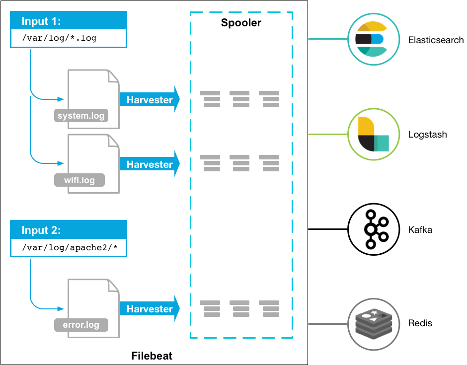

# 什么是 ELK Stack

ELK 是 3 款开源软件 [Elasticsearch](https://github.com/elastic/elasticsearch) / [Logstash](https://github.com/elastic/Logstash) / [Kibana](https://github.com/elastic/kibana) 的简称，基于这 3 款软件及其相关组件组成的数据处理系统称之为 ELK Stack。

从上面的架构图可以清晰地看到各个组件以栈[Stack]的形式构成整个系统。

由于系统涉及的组件越来越多，比如 Filebeat、Metricbeat、Kafka、Zookeeper 等，而不仅仅是 ELK，所以 ELK Stack 也逐渐被称为 Elastic Stack。

下面，简单介绍 Elastic Stack 涉及的各个组件：

## Elasticsearch

> [Elasticsearch](https://www.elastic.co/cn/elasticsearch) 是一个搜索和分析引擎，主要负责将日志索引并存储起来，方便业务方检索查询

## Logstash

> [Logstash](https://www.elastic.co/cn/logstash) 是服务器端数据处理管道，能够同时从多个来源采集数据，转换数据，然后将数据发送到诸如 Elasticsearch 等“存储库”中

## Kibana

> [Kibana](https://www.elastic.co/cn/kibana) 则可以让用户在 Elasticsearch 中使用图形和图表对数据进行可视化

## Kafka

> 在生产环境中，为了提升系统的稳定性和可扩展性，会增加一层消息队列中间件，用来「削峰填谷」，从容应对各类突发流量，保障后端日志索引服务的平稳性。
>
> [Kafka](https://kafka.apache.org/) 正是这样一款分布式消息队列服务中间件。

## Filebeat

> [Filebeat](https://www.elastic.co/cn/beats/filebeat) 是轻量型日志采集器，用于转发和汇总日志与文件，让简单的事情不再繁杂。

## 小结

基于 Elastic Stack 可以轻松打造大规模日志实时分析处理系统。

所谓「大规模」，指的是 Elastic Stack 支持每天收集、处理、索引数十甚至上百亿规模的各类日志，这主要得益于 Filebeat、Kafka、Logstash、Elasticsearch 都支持分布式部署，可以无限水平扩展。

各类文本形式的日志都在处理范围，本小册以最常见的 Nginx 访问日志为例，演示如何搭建大规模日志实时分析处理系统。对访问日志的实时分析，可以帮助我们随时掌握业务的运行状况、统计 PV/UV、发现异常流量、分析用户行为、查看热门站内搜索关键词等。
